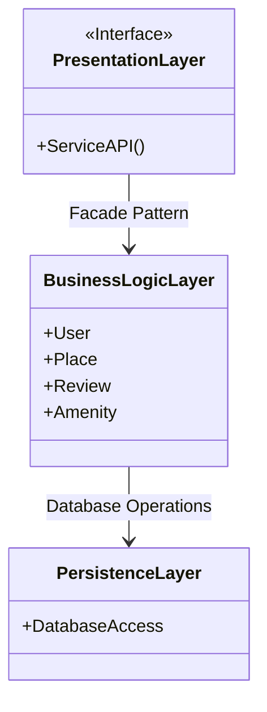
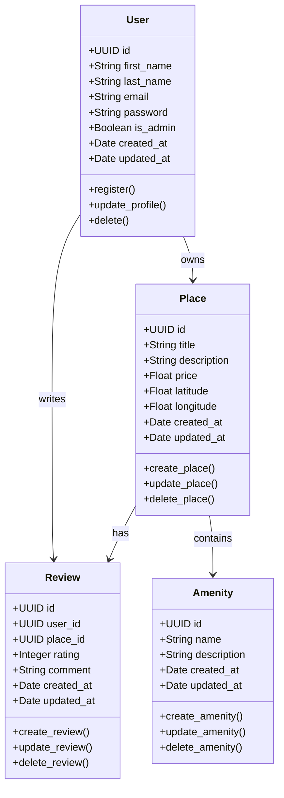
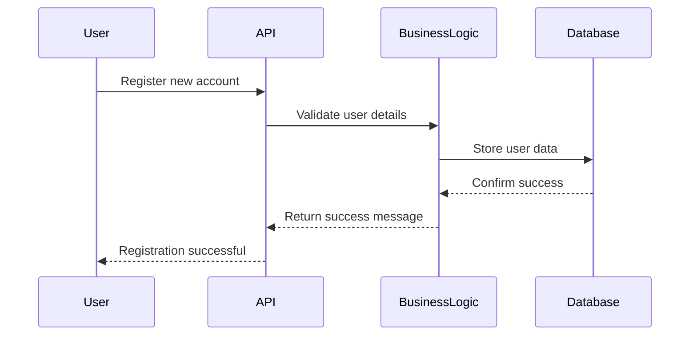
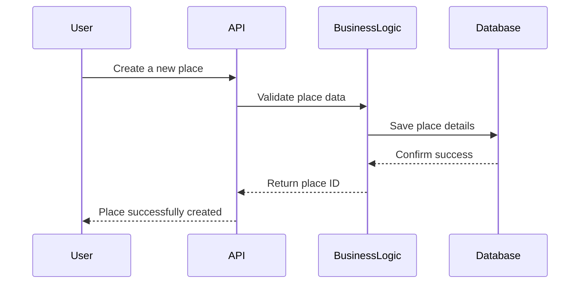
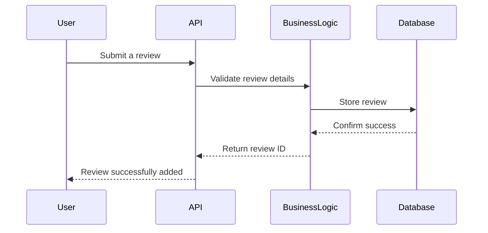
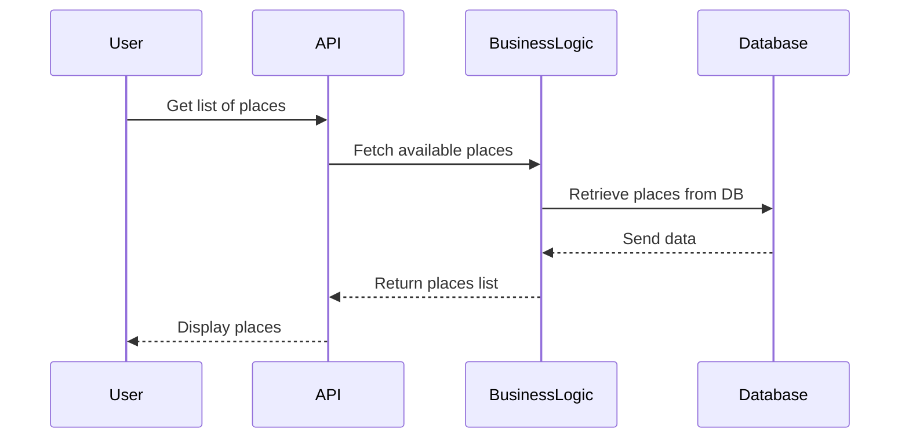

# HBnB Evolution - Technical Documentation

## **1. Introduction**
The **HBnB Evolution** project is a simplified version of an Airbnb-like application. This document serves as a **blueprint** for the system's architecture, business logic, and API interactions. It provides technical insights for implementation, ensuring a **clear structure and functionality** for the project.

The document includes:
- **High-Level Architecture**: Overview of the system layers.
- **Business Logic Layer**: Core models and their relationships.
- **API Interaction Flow**: Sequence diagrams illustrating API interactions.

---

## **2. High-Level Architecture**
### **📌 High-Level Package Diagram**
This diagram illustrates the **three-layer architecture** of the application and how the layers communicate using the **Facade Pattern**.

### **🔹 Explanation:**
- **Presentation Layer**: Handles user interactions (e.g., API endpoints).
- **Business Logic Layer**: Contains the core logic (e.g., User, Place, Review, Amenity models).
- **Persistence Layer**: Manages database storage and retrieval.

---

## **3. Business Logic Layer**
### **📌 Class Diagram**
This diagram represents the main entities in the system, their attributes, and relationships.

### **🔹 Explanation:**
- **User** owns **multiple Places** and writes **multiple Reviews**.
- **Place** is owned by a **User** and has **multiple Reviews and Amenities**.
- **Review** is linked to both a **User** (who wrote it) and a **Place**.
- **Amenity** is associated with **one or more Places**.

---

## **4. API Interaction Flow**
### **📌 API Sequence Diagrams**
The following sequence diagrams illustrate how different components interact when handling API requests.

#### **1️⃣ User Registration**

#### **2️⃣ Place Creation**

#### **3️⃣ Review Submission**

#### **4️⃣ Fetching a List of Places**

---

## **5. Conclusion**
Working on this technical documentation for **HBnB Evolution** has been a challenging but rewarding experience. Organizing the system's **architecture, business logic, and API interactions** into clear diagrams helped me gain a deeper understanding of how all the components fit together. 

One of the most interesting aspects was defining the **relationships between entities**—it made me realize how crucial **data structure planning** is for scalability and efficiency. 

Additionally, designing the **sequence diagrams** allowed me to visualize the exact flow of information between different system layers, reinforcing the importance of **well-structured API interactions**.

Overall, this documentation serves as a **blueprint for implementation**, but also as a personal milestone in my journey toward becoming a more structured and detail-oriented developer. I look forward to applying these principles as the project evolves!
