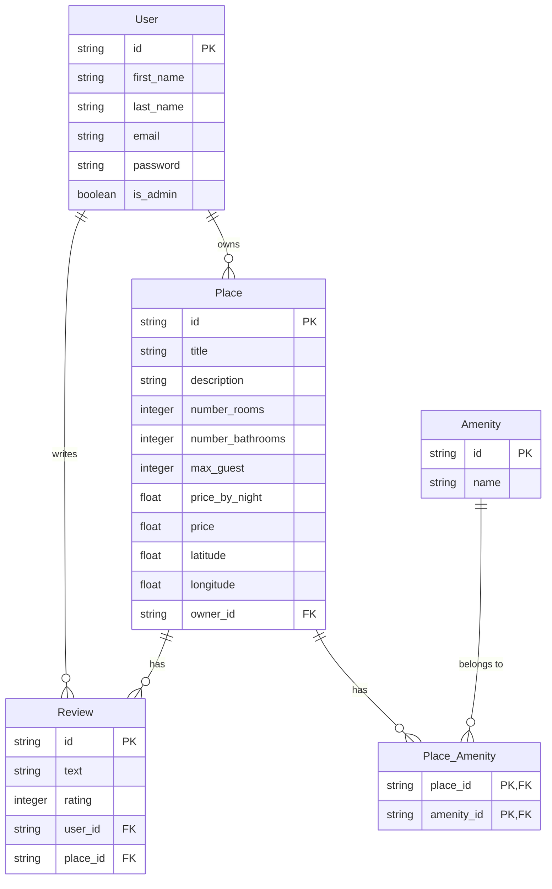

# 🏠 Holberton HBnB Project (AirBnB Clone)

## 📌 Project Overview
The **Holberton HBnB** project is a comprehensive **Airbnb clone** developed in multiple stages, from a basic command-line interface to a full-featured web application with a database backend and frontend integration. This project demonstrates the evolution of a software application through progressive enhancements and technology integration.

## 🗂️ Project Structure
The repository is organized into four parts, each representing a major development phase:

- **[Part 1](/part1)**: Command-line interface with in-memory storage
- **[Part 2](/part2)**: REST API development with Flask
- **[Part 3](/part3)**: Database integration with SQLAlchemy and authentication
- **[Part 4](/part4)**: Frontend integration and enhanced user experience

## 🛠️ Technologies Used Across All Parts
- **Python** 🐍
- **Flask** 🌶️
- **SQLAlchemy** 🗄️
- **JWT Authentication** 🔒
- **HTML/CSS/JavaScript** 🎨
- **SQLite/MySQL** 💾

## 📋 Project Evolution

### Part 1: Command Line Interface
- Console-based application for CRUD operations
- Custom storage engine with JSON persistence
- Object serialization and deserialization
- Basic command patterns and error handling

### Part 2: REST API Development
- Flask-based RESTful API
- Route configuration and HTTP methods
- Resource representation and status codes
- Basic CRUD operations via API endpoints
- JSON data format standardization

### Part 3: Database & Authentication
- SQLAlchemy ORM integration
- Database schema design with relationships
- JWT-based authentication system
- Role-based access control (admin vs regular users)
- Password hashing and security best practices

### Part 4: Frontend & Enhanced Features (Final Phase)
- Dynamic frontend integration with the API
- Enhanced user experience for place browsing
- Host name display for properties instead of IDs
- User-friendly review system with reviewer names
- Optimized API responses with related data

## 📊 Entity Relationship Diagram


## 🚀 How to Run the Complete Project
1. Clone this repository:
```bash
git clone https://github.com/judiihh/holbertonschool-hbnb.git
cd holbertonschool-hbnb
```

2. Navigate to the most recent part (Part 4):
```bash
cd part4
```

3. Set up the virtual environment:
```bash
python3 -m venv venv
source venv/bin/activate  # On Windows: venv\Scripts\activate
```

4. Install dependencies:
```bash
pip install -r requirements.txt
```

5. Run the application:
```bash
python run.py
```

## 🏁 Project Completion
The HBnB project has been successfully completed with all features implemented:
- ✅ Command-line CRUD operations
- ✅ REST API with Flask
- ✅ Database integration with SQLAlchemy
- ✅ JWT Authentication and access control
- ✅ Frontend integration with dynamic content
- ✅ User-friendly place and review display

## 👤 Author
- **Judith Espinal** - Holberton School Student
