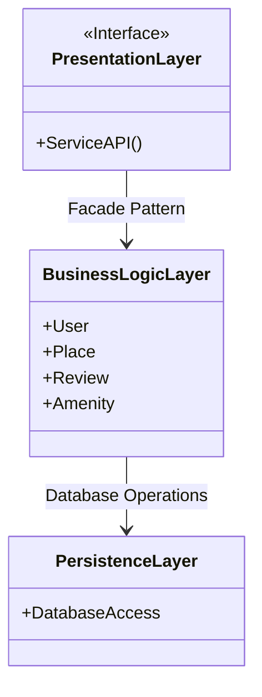
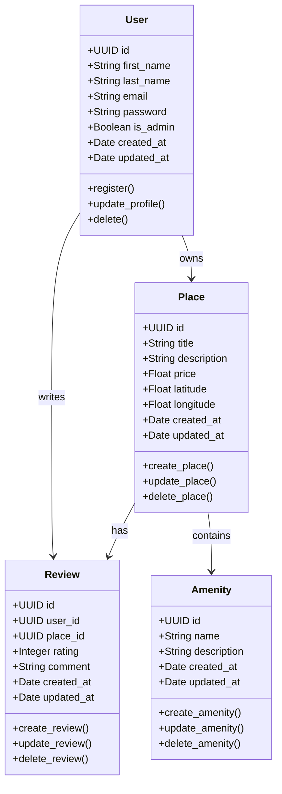
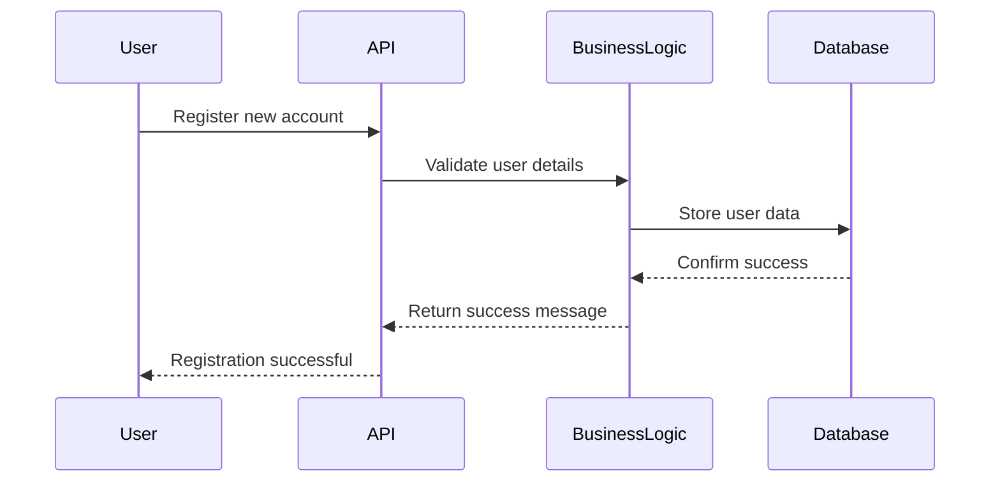
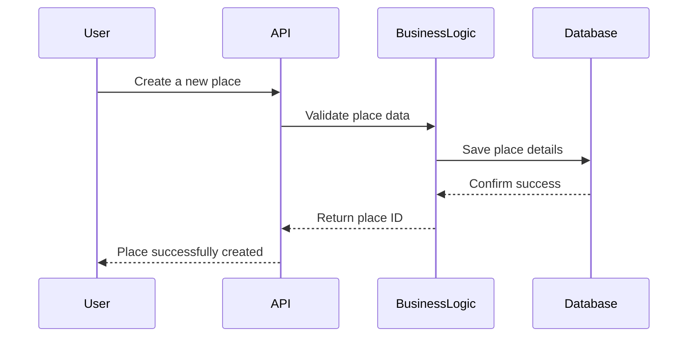
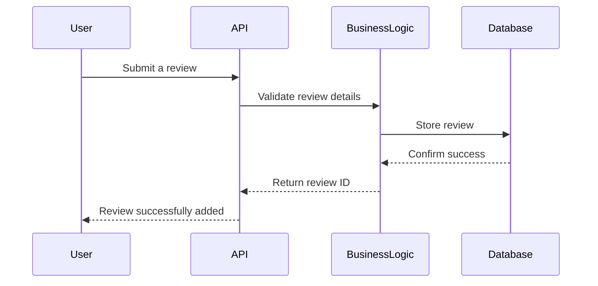
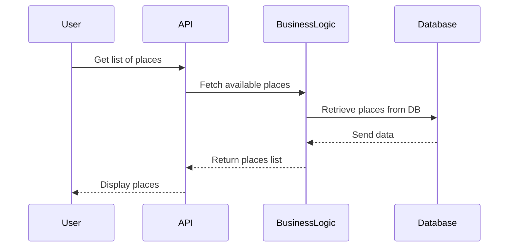

# 🏠 HBnB Project - Part 1

## **📌 Project Overview**
The **HBnB Evolution** project is a simplified version of an Airbnb-like application. This repository contains the **technical documentation** for **Part 1** of the project, focusing on the **system's architecture, business logic, and API interactions**.

## **📂 Contents**
This repository includes:
- **High-Level Architecture Documentation**
- **Business Logic Layer (Class Diagrams)**
- **API Sequence Diagrams**
- **Comprehensive Technical Documentation**

## **📑 Part 1: Technical Documentation**
### **1️⃣ High-Level Architecture**
- **Description**: The system follows a **three-layered architecture** with a **Facade Pattern** for communication.
- **Diagram:**

- **Layers:**
  - **Presentation Layer**: API and User Interface.
  - **Business Logic Layer**: Handles core logic and models.
  - **Persistence Layer**: Manages database storage and retrieval.

### **2️⃣ Business Logic Layer**
- **Entities:** User, Place, Review, and Amenity.
- **Diagram:**

- **Relationships:**
  - Users can own multiple places.
  - Users can write multiple reviews.
  - Places contain multiple amenities.

### **3️⃣ API Interaction Flow**
The **API handles key operations** for users, places, reviews, and amenities.

#### **📌 API Sequence Diagrams**
| API Call | Description |
|----------|------------|
| **User Registration** | Registers a new user in the system |
| **Place Creation** | Allows a user to create a new listing |
| **Review Submission** | Users can submit reviews for places |
| **Fetching Places** | Retrieves a list of available places |

#### **User Registration**


#### **Place Creation**


#### **Review Submission**


#### **Fetching Places**


## **🚀 How to Use This Repository**
### **Clone the Repository**
```sh
 git clone https://github.com/judiihh/holbertonschool-hbnb.git
```

### **View the Documentation**
1. Open the `README.md` to understand the project structure.
2. Navigate to `docs/` to find detailed technical diagrams.

## **💡 Future Work**
This is only **Part 1** of the project. Future phases will include:
- Database integration
- Backend API development
- Frontend implementation

## **👤 Author**
- **Judith Espinal** - Holberton School Student
