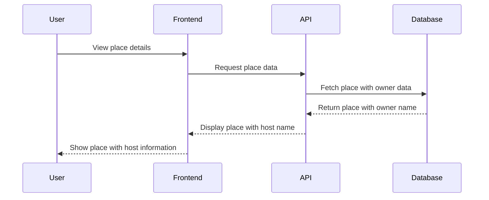

# 🏠 HBnB Project - Part 4

## **📌 Project Overview**
The **HBnB Evolution** project is an **Airbnb-like application** built with **Flask, SQLAlchemy, and JWT authentication**. This repository contains the **completed implementation for Part 4**, focusing on **enhanced user experience, data relationships, and frontend integration**.

## **📂 Contents**
This repository includes:
- ✅ **JWT-based Authentication**
- ✅ **Role-Based Access Control (Admin & Users)**
- ✅ **SQLAlchemy Database Integration**
- ✅ **CRUD Operations with Persistent Storage**
- ✅ **Mermaid.js ER Diagram for Database Visualization**
- ✅ **Frontend Integration with Dynamic User Information**
- ✅ **Host Information Display for Places**
- ✅ **Review Management with User Names**

## **🛠️ Technologies Used**
- **Python** 🐍 - Flask (REST API)
- **SQLAlchemy** 🟤 - ORM for database management
- **Flask-JWT-Extended** 🔒 - Authentication & security
- **SQLite / MySQL** 🟢 - Database storage (development & production)
- **JavaScript** 📊 - Dynamic frontend functionality
- **HTML/CSS** 🎨 - User interface styling

## **🪢 Part 4: Enhanced Features & Frontend Integration**
### **1⃣ User-Friendly Place Display**
Places now show the **owner's name as Host** instead of just an ID. This enhances the user experience by providing more meaningful information about who owns each property.

#### **📌 Host & Places Relationship**


### **2⃣ Review System with User Names**
Reviews now display the **actual name of the reviewer** instead of just user IDs. This creates a more personal and engaging review system.

### **3⃣ Backend Improvements**
- **Enhanced to_dict() Method**: Updated the Place model to include host information directly in the API response
- **Optimized API Calls**: Reduced redundant API calls by including host data in place objects
- **Consistent Data Format**: Standardized data formats across different endpoints

### **4⃣ Frontend Enhancements**
- **Responsive Place Cards**: Updated to show host information on the main listing page
- **Detailed Place View**: Enhanced to prominently display host information
- **Consistent User Experience**: Applied the same naming patterns for both hosts and reviewers

## **🚀 How to Run This Project**
### **1⃣ Clone the Repository**
```sh
git clone https://github.com/judiihh/holbertonschool-hbnb.git
cd holbertonschool-hbnb/part4
```

### **2⃣ Set Up the Virtual Environment**
```sh
python3 -m venv venv
source venv/bin/activate  # On Windows: venv\Scripts\activate
```

### **3⃣ Install Dependencies**
```sh
pip install -r requirements.txt
```

### **4⃣ Run the API**
```sh
python run.py
```

## **🏁 Project Completion**
The HBnB project has been successfully completed, implementing all required features:
- ✅ **Complete API with SQLAlchemy Database**
- ✅ **JWT Authentication System**
- ✅ **Frontend Integration with Dynamic Data**
- ✅ **Enhanced User Experience**
- ✅ **Host Information Display for Places**

## **👤 Author**
- **Judith Espinal** - Holberton School Student 
